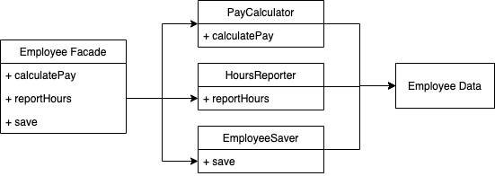
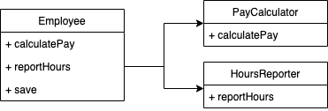
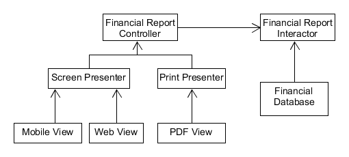
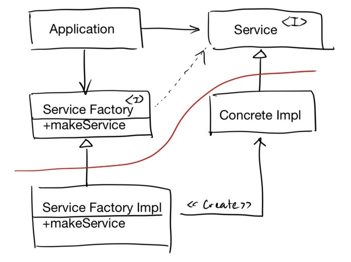

The SOLID principles tell us how to arrange our functions and data structures into classes, and how those classes should be interconnected. Goal is to create mid-level(module level) software structures that:
- Tolerate change
- easy to understand
- basis of components that can be used in many software systems

# Chapter 7:- SRP: The Single Responsibility Principle
>A module should have one and only one reason to change.

It should not be a module should do just one thing(which is basically function). From a stakeholder perspective it translates to 
>A module should be responsible to one and only one actor(people who require change).

What is a module? - Simply a file(for java kind of langulage). Cohesive set of functions and data structures. Following are symptoms of violating it.
## Symptom 1: Accidental Duplication
Consider class Employee with 3 methods:-
- calculatePay() - used by accounting department
- reportHours() - used by HR
- save() - used by database admins

Now suppose calculatePay ----> regularHours <-----reportHours

Now finance team wants change in non-overtime hours calculations which HR doesn't want. Developer changes reportHours and is validated by Finance team. Now this will cause HR millions of dollars before figuring what happened. SRP says to separate the code that different actors depend on.

## Symptom 2: Merges
Suppose database team wants a change in schema of employee and HR wants to change format of hours report. Two different deveopers from different team check out Employee class. Unfortunately their changes collide. Merge puts both DB and HR team at risk along with others dependent teams.

## Solutions
Separate the data from the functions. Three classes are not allowed to know each other. Problem being developers now have three classes that they have to instantiate and track.  A solution is to use Facade pattern

EmployeeFacade has little code and is responsible for instantiating and delegating to classes with the functions. 
Some developers prefer the most important business rules closer to the data.  In that case most important methods will be in original Employee class and then using that class as a Facade for the lesser functions.

## Conclusion
SRP is about functions and classes. At component level it becomes Common closure Principle. At architectural level it becomes axis of change responsible for the creation of Architectural boundaries.

# Chapter 8: OCP: The Open-Closed Principle
> A software artifact should be open for extension but closed for modification.

Consider a system that displays a financial summary on a web page. The data on the page is scrollable and negative numbers are rendered in red. Now there is new requirement that same information be turned into a report to be printed on a black and white printer. Negative numbers are now surrounded by parenthesis.
By applying SRP we get following data flow:-
<pre>
financial data -----> financial analyzer ----> Financial Report Data----> web reporter 
                                                                                        |-----------------> Print reporter
</pre>
Now, source code dependencies need to ensure that changes to one of responsibilities do not change cause in the other. New organization should ensure that the behavior can be extended without modification. This is accomplished by partitioning the processes into classes and separating those classes into components.

Following is component level Architecture

If component A should be protected from changes in component B, then B should depend on component A. Interactor holds business rules and has central concern. Controller is central to Presenters and Views. Thus we get a hierarchical protection. Highest level components in hierarchy are protected from the changes made to lower level components.

Following is final class structure. DS is data structure.

Even though our first priority is to protect the interactor from changes to the controller we also want to protect the controller from changes to Interactor by hiding the internals of the interactor.

## Conclusion
Ocp partitions the system into components and arranges those components into a dependency hierarchy that protects higher level components from changes in lower level components.

# Chaper 9:- LSP: The Liskov Substitution Principle
Any subtype of usage of interface should not change behavior of higher application. Example of Square of abstract type rectangle where it breaks.

    Rectangle r = ....
    r.setW(5);
    r.setH(2);
    assert(r.area() == 10); # square would fail it

## Example LSP violation
Consider a taxi aggregator which dispatches many taxi services. Now each company much conform to same REST interface. Now suppose there is a powerful taxi company which doesn't want to conform to your REST interface but provides its own interface. Simplest way to accomplish this goas would be to add an if. It would lead to mysterious errors and security breaches. Any future such incidence would force another if statement. This would be avoided by a configuration database:-

| URI             |   Dispatch format |
|---------------|:----------------------|
|Acme.com   | /pickupAddress/%s/pickupTime/%s/dest/%s |
| \*.\*              | /pickupAddress/%s/pickupTime/%s/destination/%s |

Due to unsubstitutabilty of interfaces a complex mechanism has to be put in place.

## Conclusion
A simple violation of substitutability can cause a system's architecture to be polluted with a significant amount of extra mechanisms.

# Chapter 10:- ISP:The Interface Segregation Principle
In a statically types language consider a class whose three functions op1, op2 and op3 are used by three Users User1, User2 and User3. Dependence means change in op1 will lead to recompilation and redeployment of all three Users. In dynamically typed language like python, declarations don't exist in source code but inferred at runtime. Thus, there are no source code dependencies to force recompilation and redeployment. Dynamically types languages create systems that are more flexible and tightly coupled than statically typed language.

Solution - Create separate interfaces for each user.
ISP is a language issue rather than architecture issue. Depending on something that carries baggage that you don't need can cause you troubles that you didn't expect. This idea is later covered in "component cohesion"

# Chapter 11: DIP: The Dependency Inversion Principle
> Most flexible systems are those in which source code dependencies refer only to abstractions, not to concretions.

Class like String is stable. we tolerate such concrete dependencies(stable background and OS and platform facilities). We avoid depending on **volatile** concrete elements of our system that we want to avoid depending on.
## Stable abstractions
Every change to abstract interface corresponds to a change to its concrete implementations but converse is not true. Thus, interfaces are less volatilte. Good software designers work hard to reduce the volatility of interfaces. DIP gives following coding practices:-
- Don't refer to volatile concrete classes - Refer to abstract interfaces instead. This also puts severe constraints on creation of objects and generally enforces use of abstract factories.
- Don't derive from volatile concrete classes - Inheritence is strongest, most regid of all source code relationships.
- Don't override concrete functions - Rather make function abstract and create multiple implementations
- Never mention name of anything concrete and volatile - basically the principle

## Factories
To comply, creation of volatile concrete objects requires special handling. Abstract Factory manages this undesirable dependency.

The curved line is an architectural boundary separating abstract from concrete. Flow of control crosses the curved line in opposite direction of source code dependencies(dependency inversion). DIP violation can't be entirely removed but can be gathered into a small number if concrete components and kept separate from rest of the system.  Main usually violates DIP as it instantiates concrete implementation.

DIP is most visible organizing principle in architecture diagrams. It will become a new rule for architecture boundary call dependency rule.

# Appendix
- Dynamically vs statically types language- Statically typed programming languages do type checking at compile-time as opposed to run-time.

# Image Source
1. component design https://ivohasablog.com/2018/03/25/solid-solutions/
1. class design https://usermanual.wiki/Document/2017Clean20Architecture20A20Craftsmans20Guide20to2020Robert20C20Martin.1831389213/html
1. abstract factory https://blog.heron.me/design-principles-b90e8a81a713
